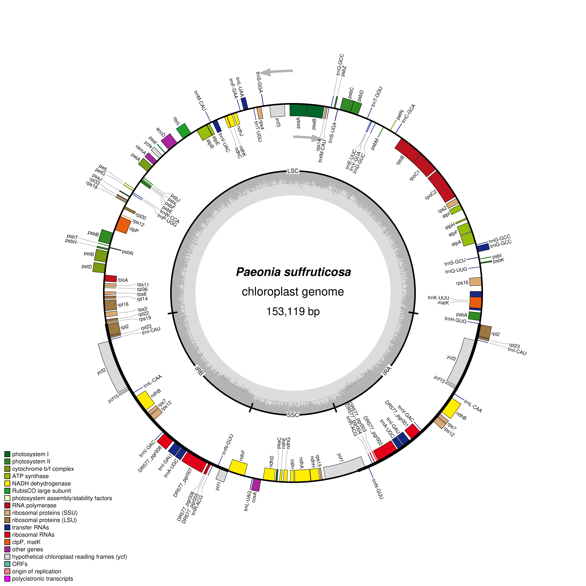

# Visualize Plastid Genome Structure

This folder contains the files and documentation for the plastid genome visualization activity using OGDRAW.

# Visualize Plastid Genome Structure

## Student Information

**Name:** Kyla Rose D. Villegas

**Scientific Name:** *Paeonia suffruticosa*

**NCBI Accession Number:** NC_037879.1

**Plastid Genome Length:** 153,119 bp

## Source of Genome File

The annotated chloroplast genome was obtained from the NCBI Nucleotide database using accession **NC_037879.1**. The GenBank file used for visualization is:

`data/Paeonia_suffruticosa_NC_037879.1.gb`

## Software Used

**OGDRAW (OrganellarGenomeDRAW)**

OGDRAW was used to generate the circular plastid genome map from the annotated GenBank file. OGDRAW converts annotated GenBank or EMBL files into graphical organelle genome maps. [OGDRAW](https://chlorobox.mpimp-golm.mpg.de/OGDraw.html?utm_source=chatgpt.com)

## OGDRAW Settings

The following settings were used:

- **Mode:** Standard
- **Genome shape:** Circular
- **Sequence source:** Plastid
- **Inverted Repeat:** Auto
- **Draw GC content graph:** Enabled
- **Show direction of transcription:** Enabled
- **Show full legend:** Enabled
- **Label intron-containing genes with *:** Enabled
- **Output format:** PNG

## Plastid Genome Map

## Structural Features Observed

The *Paeonia suffruticosa* chloroplast genome is organized into four major structural regions: the Large Single-Copy (LSC) region, the Small Single-Copy (SSC) region, and two Inverted Repeat regions (IRa and IRb). The genome is circular and contains protein-coding genes, transfer RNA genes, and ribosomal RNA genes. The map also shows the direction of transcription using arrows and displays the GC content around the genome. The inverted repeat regions contain duplicated genetic features, while the LSC and SSC regions contain many of the other plastid genes.

## Answers

The answers to Questions 1–10 are located in:

[`Lab_plastid_genome_answers.md`](answers/Lab_plastid_genome_answers.md)
